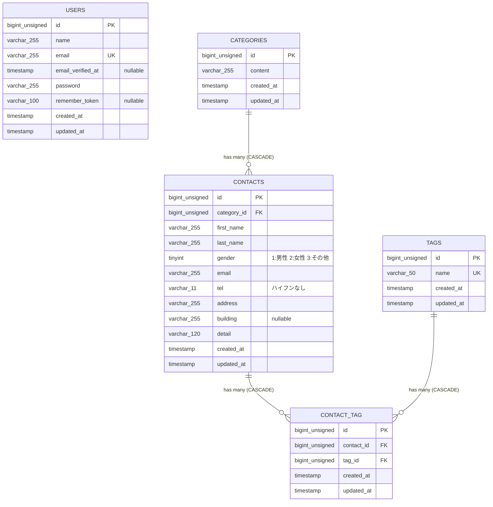

# COACHTECH お問い合わせフォーム

Laravel を使って作成したお問い合わせフォームアプリです。
カテゴリ管理、タグ付け、バリデーションなど、基本的な CRUD 機能を学習できます。

## 作成者

山口 琴音

## 使用技術

- PHP 8.2  
- Laravel 10.x  
- MySQL 8.x  
- Docker / Laravel Sail  
- Node.js 18.x（Vite / npm） 

## ER図




## 開発環境URL

http://localhost


## 動作環境

- Docker Desktop  
- Laravel Sail  
- MySQL 8  
- Node.js / npm  
- Vite  

## 環境構築手順

1. **リポジトリをクローン**

    ```bash
    git clone https://github.com/osakana-works/coachtech-contact-form-.git
    cd coachtech-contact-form-
    ```

2. **.envファイルの準備**

    `.env.example` をコピーして `.env` を作成し、  
    DB 接続情報を環境に合わせて設定。

    ```bash
    cp .env.example .env
    ```

3. **Composer依存パッケージのインストール**

    ```bash
    composer install
    ```

4. **Laravel Sailの起動**

    ```bash
    ./vendor/bin/sail up -d
    ```

5. **アプリケーションキーの生成**

    ```bash
    ./vendor/bin/sail artisan key:generate
    ```

6. **データベースのマイグレーションと初期データ投入**

    ```bash
    ./vendor/bin/sail artisan migrate --seed
    ```

7. **フロントエンドのビルド**

    ```bash
    npm install
    npm run dev
    ```

8. **アプリケーションへのアクセス**

    http://localhost  
    または  
    http://localhost:8080


## テスト実行

```bash
./vendor/bin/sail artisan test
```

## 機能一覧

- お問い合わせ登録
- お問い合わせ検索（キーワード / 性別 / カテゴリ / 日付）
- CSV エクスポート
- タグ管理（追加 / 編集 / 削除）
- 管理画面（ページネーション）
- API（CRUD）


## APIエンドポイント一覧

| HTTPメソッド | URI | 概要 |
|---|---|---|
| GET | /api/v1/contacts | お問い合わせ一覧取得（検索・ページネーション対応） |
| GET | /api/v1/contacts/{id} | お問い合わせ詳細取得 |
| POST | /api/v1/contacts | お問い合わせ作成 |
| PUT | /api/v1/contacts/{id} | お問い合わせ更新 |
| DELETE | /api/v1/contacts/{id} | お問い合わせ削除 |

### 検索パラメータ（GET /api/v1/contacts）

| パラメータ | 型 | 説明 |
|---|---|---|
| keyword | string | 氏名・メールアドレスで部分一致検索 |
| gender | integer | 性別（1:男性 / 2:女性 / 3:その他） |
| category_id | integer | カテゴリID |
| date | date | 作成日（YYYY-MM-DD） |
| per_page | integer | 1ページあたりの件数（デフォルト:10 / 最大:100） |
| page | integer | ページ番号 |
